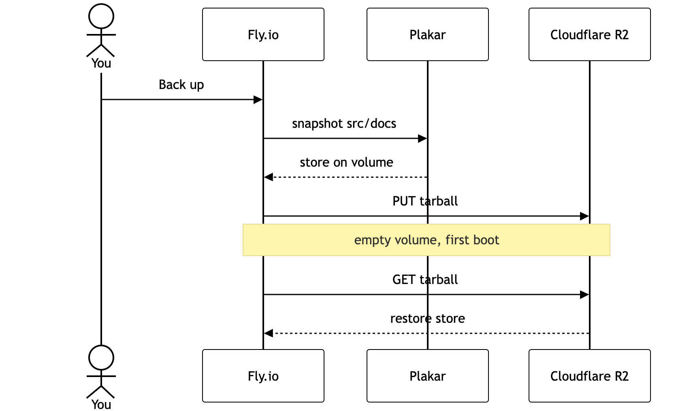

# Nimbus Docs, a Wayback Machine for documentation, powered by Plakar + R2

Browse a documentation site at any point in its history, securely and on demand.

Every past version is a [Plakar](https://www.plakar.io) encrypted snapshot, secured offsite in Cloudflare R2.

When you request an old version, the backend retrieves it from the backup: its pages, images, PDFs, CSV/JSON references, and stylesheet.

## Backups and R2

Click **Create new version** to back up the current docs as a saved version, mutate them into the next one, and (if R2 is configured) upload a tarball of the store.



## Quick start

You need Node 22+ and `plakar` 1.1.0+. Once they are installed, run the following commands:

```bash
npm install
cp .env.example .env
npm run seed        # builds the v1…v5 history into ./.plakar/store
npm run dev
```

`npm run seed` runs [seed/index.mjs](seed/index.mjs): it wipes the Kloset store, then snapshots `seed/versions/v1`…`seed/versions/v4` as past versions and leaves `seed/versions/v5` in `src/docs` as the live current version.

To build and serve in production:

```bash
npm run build
npm run start
```

## Deploy

The app runs `plakar` as a subprocess, so it needs a long-lived Node process and a disk. The [Dockerfile](Dockerfile) installs the binary. [fly.toml](fly.toml) mounts a volume at `/data`.

```bash
# set `app` in fly.toml to a unique name
fly apps create <name>
fly volumes create plakar_data --region iad --size 1
fly deploy
fly open
```

The image bakes the pre-built v1…v5 history (the Dockerfile runs `npm run seed` during the build). On boot the entrypoint installs it onto the volume when the volume is empty, or when the image's `SEED_VERSION` differs from the one recorded on the volume. Bumping `SEED_VERSION` in the [Dockerfile](Dockerfile) therefore reinstalls the canonical history on the next deploy. Otherwise the volume persists, so versions created from the UI survive restarts and redeploys. (If no baked store is present it falls back to restoring from R2, then to an empty store.)

```bash
fly secrets set R2_ACCOUNT_ID=… R2_ACCESS_KEY_ID=… R2_SECRET_ACCESS_KEY=…
```

Set `PLAKAR_PASSPHRASE` as a Fly secret before the first deploy unless `wayback-demo` is fine. A new passphrase cannot open the old store. Destroy the volume if you need to start over.

## Credits

All sample documentation images are photos from [Unsplash](https://unsplash.com), used under the [Unsplash License](https://unsplash.com/license): the per-version heroes in `seed/versions/**/images`, the shared media kit in `seed/shared/media`, and the tweet-card avatars.
